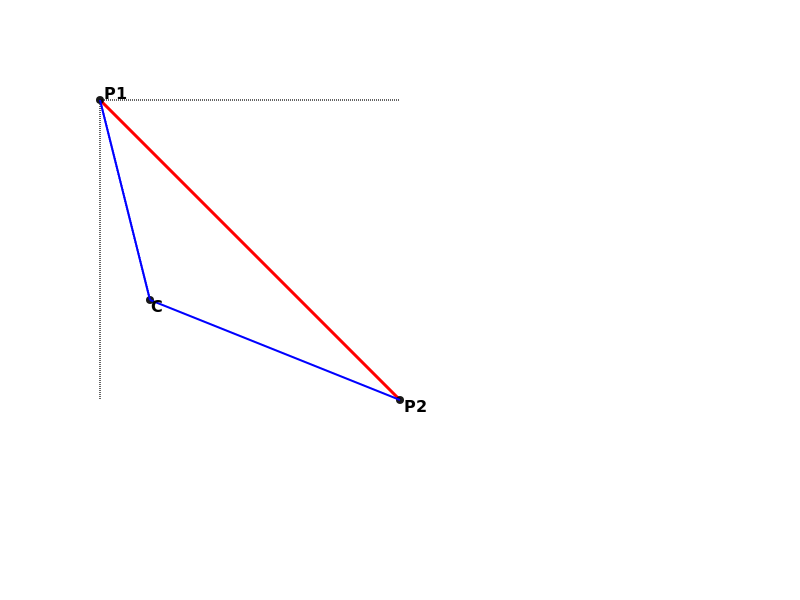

# Sample of graphic 2D shapes

## Collisions of shapes

### Point and circle

The collision of a point and a circle is quite simple. We need to calculate the distance from the point and the center of the circle. If it's smaller or equal the radius the collision is true.

The formula to calculate the generic distance between two points is

$$\bold{D=\sqrt{(x_2-x_1)^2 + (y_2-y_1)^2}}$$

now we can test the condition $\bold{D \le r}$ to have the result.

### Point and line

Suppose to have a line from the point **P1** to the point **P2** and another point **C**. We want to know if the point is on the line.
Let's start calculating the distance $\bold{d1 = |C-P_1|}$ and $\bold{d2 = |P_2-C|}$ and compare it with $\bold{d = |P_2-P_1|}$. If the distance of the points is equal to the sum $\bold{d = d1 + d2}$ the point is on the line.

It's useful to define a tolerance because of pixel approximation to detect the collision. Let's call it **T**; the higher it is the less accurate is the result. In our code the value is 0.1.

The conditon will be:

$$\bold{(d - T) \le (d1 + d2) \le (d + T)}$$
 

### Circle and line

The collision of a circle and line can be used to approximate the collision of a point wich rapresent moused coordinates. It's useful because we can calculate the closest point to the line, set a threshold and decide to "snap" the circle or have a over effect when the cursor is near the line.

Let's have a segment from P1 to P2 and a generic point C which will be the center of our circle. 
The closest point to C on the segment must obviusly stay between P1 and P2 and it is the intersection of the perpendiculer line from C to the segment itself. We call it C1.

C1 can be P1 or P2 or stay between them.

To identify the collision we want to have as a result a boolean that indicats if there is the collision with a threshold and two coordinates that indicates the closest point on the line.

We can proceed in three steps:

1. Check if P1 is inside the circle, if so the collision point is P1 (we can use the collision with circle and point).
2. Check if P2 is inside the circle, if so the collision point is P2.
3. Calculate the closest point C1 between P1 and P2 and check if it is actually on the segment.
4. Check if C1 is inside the circle, if so the collision point is C1.

**1.** and **2.** are described in the previous chapter. Here let's calculate the closest point on the segment from the center of the circle. As we can see in the picture below we want to know the projection of the center C on the segment **C1**.

![Semantic description of image]
(./graph.svg - "Image Title")

First of all we need to use the dot product of vectors to calculate the norm of the vector $\vec{P_1C_1}$. This is the projection of $\vec{P_1C}$ on the unit vector with origin in $P_1$ and direction equal to $\vec{P_1C_1}$, we can call it $\vec{e_1}$.

First of all the norm of $\vec{P_1P_2}$ is:

$$\bold{L} = |P1 - P2| = \sqrt{(x_2 - x_1)^2+(y_2 - y_1)^2}$$

the unit vector is

$$\vec{e_1} = \frac{\vec{P_1P_2}}{\bold{L}}$$

So

$|C1 - P1|=\vec{P_1C_1}\cdot\vec{e_1}=\vec{P_1C_1}\cdot\frac{\vec{P_1P_2}}{\bold{L}}=\frac{(C_x-x_1)(x_2-x_1)+(c_y-y_1)(y_2-y_1)}{\bold{L}}$

now we need the two components on the **X** and **Y** axis of $\vec{P_1C_1}$. So

$\vec{P_1C_1}_x=({P_1}_x-{C_1}_x) = \frac{L}{cos(α)}$

$\vec{P_1C_1}_y=({P_1}_y-{C_1}_y) = \frac{L}{sin(α)}$

where

$cos(α)=\frac{\bold{L}}{(x_2-x_1)}$

$sin(α)=\frac{\bold{L}}{(y_2-y_1)}$

Finally we have:

${C_1}_x=x_1+\frac{(c_x-x_1)(x_2-x_1)+(c_y-y_1)(y_2-y_1)}{\bold{L}^2}(x_2-x_1)$

${C_1}_y=y_1+\frac{(c_x-x_1)(x_2-x_1)+(c_y-y_1)(y_2-y_1)}{\bold{L}^2}(y_2-y_1)$

We need to check if the closest point **C1** is between P1 and P2 (it can be outside), we can use the **pointInLine** function. If true we can calculate the distance from the center **C** of the circle and test if is below a threshold. In positive case we have the collision.

### Point and polygon

