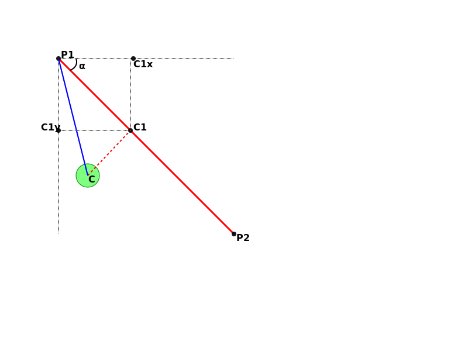

# Sample of graphic 2D shapes

## Collisions of shapes

### Point and circle

### Point and line

### Circle and line

The collision of a circle and line can be used to approximate the collision of a point wich rapresent moused coordinates. It's useful because we can calculate the closest point to the line, set a threshold and decide to "snap" the circle or have a over effect when the cursor is near the line.

Let's have a segment from P1 to P2 and a generic point C which will be the center of our circle. 
The closest point to C on the segment must obviusly stay between P1 and P2 and it is the intersection of the perpendiculer line from C to the segment itself. We call it C1.

C1 can be P1 or P2 or stay between them.

To identify the collision we want to have as a result a boolean that indicats if there is the collision with a threshold and two coordinates that indicates the closest point on the line.

We can proceed in three steps:

1. Check if P1 is inside the circle, if so the collision point is P1 (we can use the collision with circle and point).
2. Check if P2 is inside the circle, if so the collision point is P2.
3. Calculate the closest point C1 between P1 and P2 and check if it is actually on the segment.
4. Check if C1 is inside the circle, if so the collision point is C1.

$|P1 - P2| = L = \sqrt{(x_2 - x_1)^2+(y_2 - y_1)^2}$

